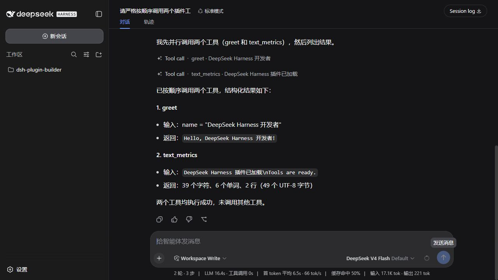
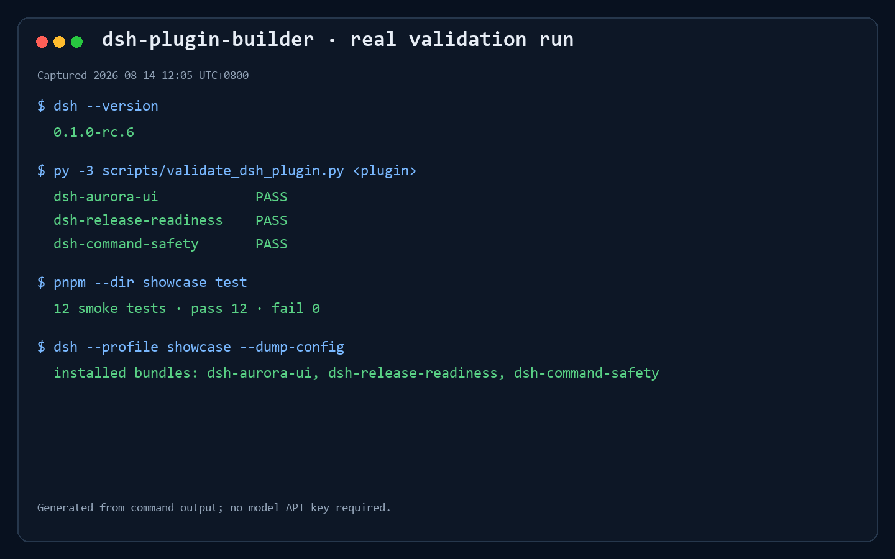

# dsh-plugin-builder

[](./LICENSE.txt)
[](https://github.com/deepseek-ai/deepseek-harness)
[](./SKILL.md)
[](./scripts/validate_dsh_plugin.py)

[中文文档](./README_CN.md)

An Agent Skill for designing, generating, validating, and packaging installable [DeepSeek Harness](https://github.com/deepseek-ai/deepseek-harness) (`dsh`) plugins.

It does not jump straight to boilerplate. It first decides whether the request belongs in a tool, policy hook, provider seam, LLM adapter, client node, protocol bridge—or should not be a plugin at all. Valid requests become independent ESM packages with a `dsh.bundle`, development overlay, design record, and verification commands.

Validated on Windows with `@deepseek-ai/dsh@0.1.0-rc.6`. Harness is a developer preview and may introduce breaking changes.

## Tested showcase

The repository includes three plugins generated by following this Skill end to end:

| Package | Shape | Extension point | Demonstrates |
|---|---|---|---|
| [`dsh-greeter`](./showcase/dsh-greeter) | Tool | `ctx.tools.register()` | Typed arguments, structured output, configurable rendering |
| [`dsh-text-metrics`](./showcase/dsh-text-metrics) | Tool | `ctx.tools.register()` | Object output schema, size guard, loud config failure |
| [`dsh-command-safety`](./showcase/dsh-command-safety) | Hook | `tools/pre-execute` | Safe delegation through `next()` and typed denial |

### Actual DeepSeek Harness Web UI

This is a real browser capture of the locally running `web` profile with all three showcase bundles installed. A configured third-party `opencode-go / DeepSeek V4 Flash` model invoked `greet` and `text_metrics`; the visible tool rows and structured results come from that live conversation.



The screenshot is not generated or composited. Tool and hook plugins do not receive custom Web Settings cards automatically. The policy-only `dsh-command-safety` plugin is therefore covered by its smoke tests and the validation report below.

### Generated validation report

The following image is an automatically rendered report, not a Web UI screenshot. Its source data comes from a real validation run of the installed CLI, static validator, smoke tests, and installed profile check.



Regenerate it with:

```powershell
py -3 scripts/render_showcase_validation.py
```

## Install the Skill

Clone this directory into a skill root scanned by your agent client. Keep the folder name `dsh-plugin-builder`.

```powershell
git clone https://github.com/kingjly/dsh-plugin-builder.git "$HOME/.grok/skills/dsh-plugin-builder"
```

Common locations:

```text
~/.grok/skills/dsh-plugin-builder/       # Grok
~/.claude/skills/dsh-plugin-builder/     # Claude Code
.agents/skills/dsh-plugin-builder/       # project-local clients
```

The directory is ready when `SKILL.md` exists at its root.

## Use it

Explicit invocation:

```text
/dsh-plugin-builder Create a model-callable text statistics tool in ./dsh-text-metrics. Build an installable bundle and test it locally first.
```

Natural-language requests such as “write a DeepSeek Harness plugin” may also activate the Skill automatically.

For the most precise result, state:

- the capability and its side effects;
- the output directory;
- whether you want a local `--patch` run, an installable bundle, or both;
- environment variable names for credentials—never paste live secret values into generated files.

Defaults are: out-of-tree Host plugin, TypeScript ESM, `web` profile, no loop changes, local overlay before installation.

## Decision-first workflow

The Skill applies the first matching extension strategy:

| Request | Result |
|---|---|
| Add a new structured capability for the model | Tool plugin with `defineTool()` |
| Intercept or deny an existing tool call | `tools/pre-execute` hook or guard |
| Replace filesystem, shell, search, sandbox, or subagent execution | Existing Service Provider seam |
| Add or route a model backend | Configure `dsh-llm-pi-ai` first; write an adapter only when necessary |
| Add a replayable Chat row or browser surface | Host event plus Client Conversation Node |
| Connect an IM, IDE, or automation protocol | Protocol bridge over `ctx.agents` |
| Change `agent-loop`, duplicate `bash`, or rewrite an existing MCP tool | Refuse and point to the supported seam |

Every generated package records this choice in `plugin-design.md` before implementation.

## Run the showcase

Prerequisites: Node.js 22+, pnpm, Python 3.10+, and DeepSeek Harness.

```powershell
pnpm add --global @deepseek-ai/dsh@0.1.0-rc.6
py -3 scripts/render_showcase_overlays.py
cd showcase
pnpm install
pnpm build
pnpm test
```

Load all three plugins into the Web profile from source:

```powershell
dsh web --patch ./cordis.dev.yml
```

Open `http://127.0.0.1:3080`.

On Windows, local ESM entries in `cordis.dev.yml` must be `file:///C:/...` URLs. A bare `C:/...` path is interpreted as an unsupported `c:` URL scheme. POSIX uses ordinary absolute paths.

`render_showcase_overlays.py` rebuilds those absolute import specifiers for the current checkout, so the committed examples remain runnable after cloning to another path.

Install the bundles into a dedicated profile and inspect the composed layer:

```powershell
dsh plugin --profile showcase add ./dsh-greeter ./dsh-text-metrics ./dsh-command-safety
dsh --profile showcase --dump-config
```

No model key is required for compilation, static validation, smoke tests, bundle installation, or configuration expansion. A configured model is required for an end-to-end conversation in the Web UI.

## Generated package contract

```text
dsh-<slug>/
├── src/index.ts          # name + inject + apply + Schemastery Config
├── test/smoke.test.mjs   # success and failure paths
├── cordis.dev.yml        # source overlay; absolute import specifier
├── cordis.patch.yml      # installed bundle layer; package name
├── plugin-design.md      # shape decision and verification plan
├── package.json          # ESM + dsh.bundle + self-contained prepare
├── tsconfig.json
└── README.md
```

The default template builds with `tsc` rather than a native bundler, keeping small plugins portable and Git `prepare` installs self-contained.

## Validate a generated plugin

```powershell
py -3 scripts/validate_dsh_plugin.py ./showcase/dsh-greeter
```

The validator checks:

- ESM and `dsh.bundle.patch` metadata;
- patch and plugin entry existence;
- exported `name`, `apply`, and Schemastery `Config` shape;
- collisions with shipped tool names;
- likely hard-coded credentials;
- invalid bare Windows paths in development overlays.

It is a fast static gate. Real delivery should also compile, run smoke tests, load the overlay, and inspect `--dump-config`.

## Repository map

```text
├── SKILL.md                 # routing and delivery contract
├── assets/templates/        # ESM plugin and bundle templates
├── references/              # tool, hook, adapter, UI, safety, publish rules
├── scripts/                 # templates, overlay renderer, validator, report renderer
├── showcase/                # three generated and tested plugins
├── examples/                # request fixtures
└── evals/                   # rubric, failure taxonomy, evaluation cases
```

## Important limits

- DeepSeek Harness is in developer preview; re-check official contracts when versions change.
- Out-of-tree plugins do not automatically receive a card in Web Settings.
- Preset-mounted plugins cannot safely register a global settings namespace.
- Git installs run a package's `prepare` script only when pnpm build permissions allow it; prefer trusted, commit-pinned sources or prebuilt tarballs.
- `dsh-command-safety` is an example policy layer, not a complete shell sandbox.

## License

[MIT](./LICENSE.txt)
