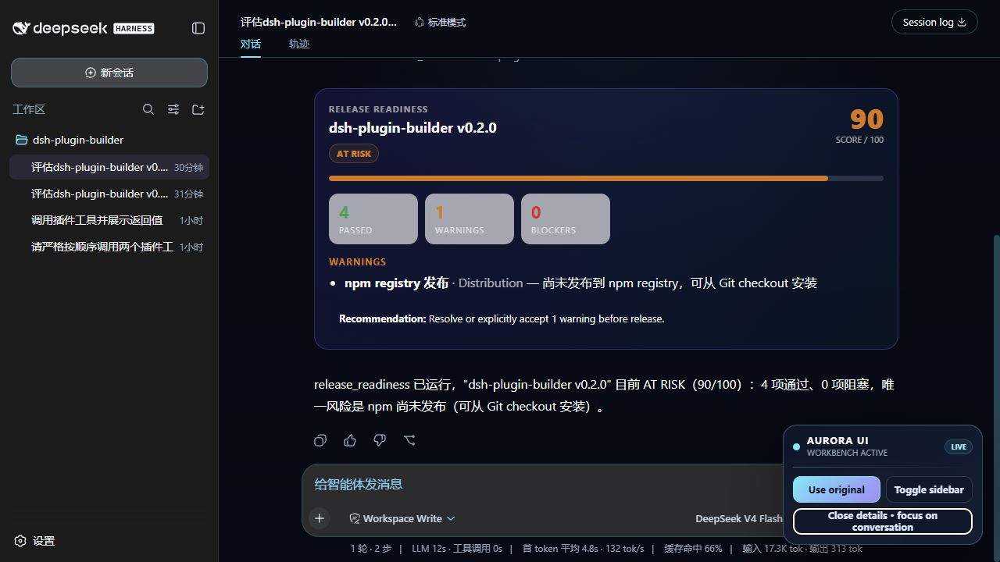
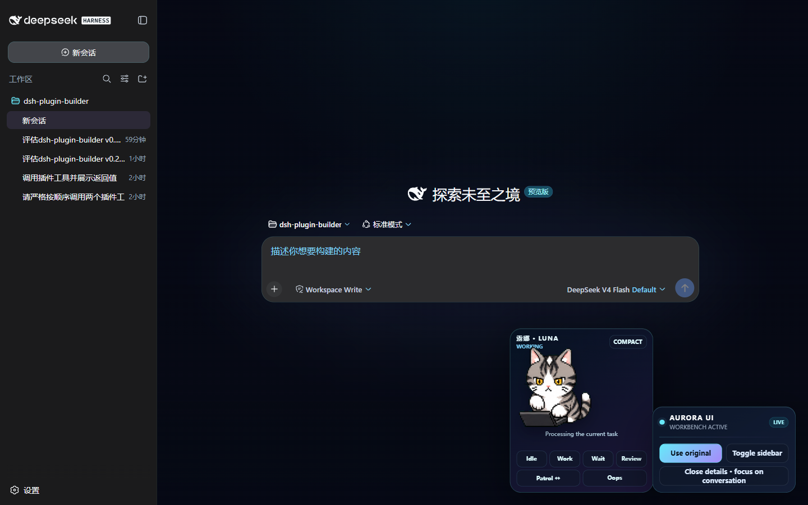
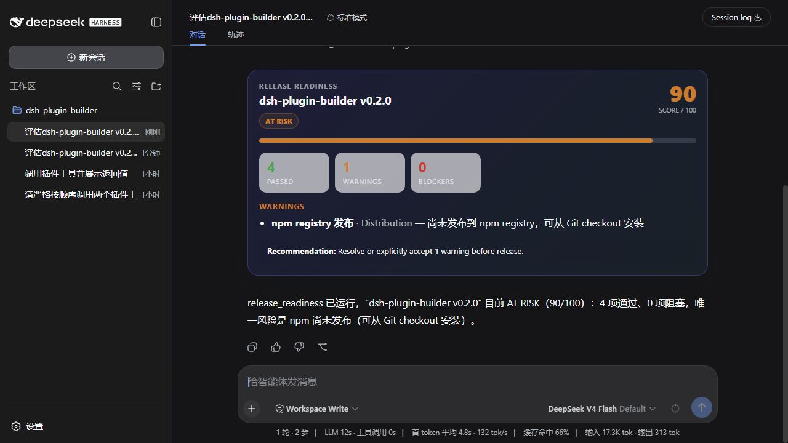
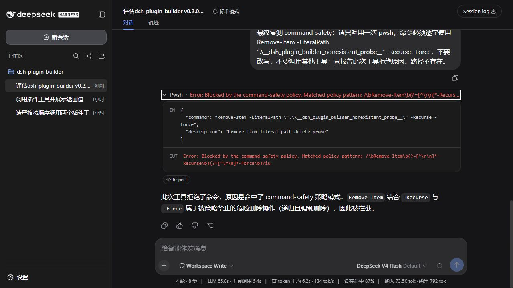
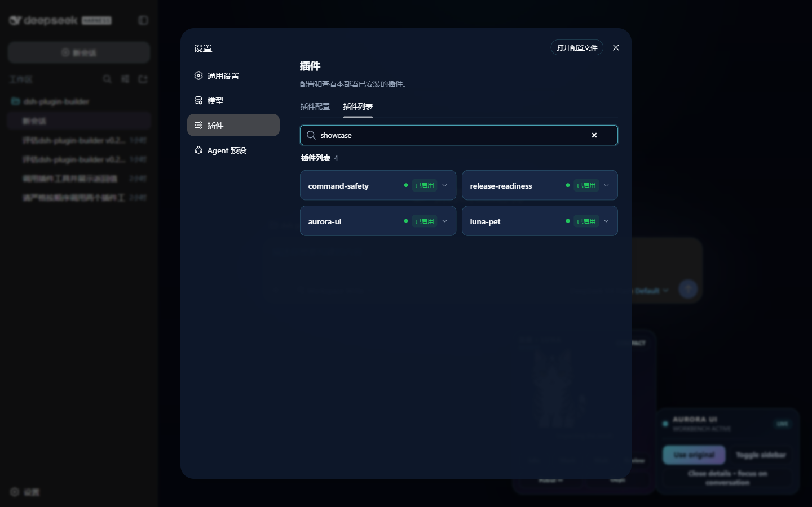

# dsh-plugin-builder

[](./LICENSE.txt)
[](https://github.com/deepseek-ai/deepseek-harness)
[](./SKILL.md)
[](./showcase)

[English](./README.md)

一个用于决策、创建、验证和打包 [DeepSeek Harness](https://github.com/deepseek-ai/deepseek-harness)（`dsh`）插件的 Agent Skill。

它不会直接套脚手架，而是先选择最窄、最合适的官方扩展点：工具、策略 guard、Provider seam、LLM 适配器、Client Conversation Node、主题或 Shell 贡献、协议桥，或判断根本不该做插件。确定方案后会生成独立的 TypeScript ESM 包，包含 `dsh.bundle`、开发 overlay、设计记录、smoke tests 和验证命令。

已在 Windows 上用 `@deepseek-ai/dsh@0.1.0-rc.6` 实测。Harness 仍处于开发者预览，后续可能出现破坏性变更。

## 四个真正可见、可用的插件

仓库现在包含四个严格按本 Skill 流程生成的插件。它们都已安装进本机 `web` profile，能在设置里检索，也都在真实 Web UI 中执行过。

| 包 | 形态与扩展点 | 实际效果 |
|---|---|---|
| [`dsh-aurora-ui`](./showcase/dsh-aurora-ui) | 纯 Client Web UI；`ctx.theme.register()`、additive `shell.overlay` 与 `ctx.layout` | 把整套 Web 界面换成青/紫 Aurora 主题，并增加可切换主题、侧栏和详情面板的悬浮控制器。 |
| [`dsh-luna-pet`](./showcase/dsh-luna-pet) | 纯 Client Web UI；带内嵌 8×9 WebP 图集的 additive `shell.overlay` | 复用用户已有 Luna，提供工作、等待、审阅、巡逻、摸头、满足和故障动画，以及紧凑模式。 |
| [`dsh-release-readiness`](./showcase/dsh-release-readiness) | Host Tool + Client Conversation Node；`ctx.tools.register()` 与 `conversation.chat.node` | 模型提交有证据的发布门禁，Chat 直接渲染带评分、警告和阻断项的发布面板；服务重启后可从核心 `tool/result` 元数据回放。 |
| [`dsh-command-safety`](./showcase/dsh-command-safety) | 单调策略 guard；`ctx.tools.guard()` | 带破坏性特征的 `bash`/`pwsh` 调用会在 Shell 运行前被拒绝，对话中会显示命中的规则。 |

### 整套 Web UI 换成 Aurora 工作台

`dsh-aurora-ui` 注册第三方语义主题，并向 Shell 追加一个浮层。下图里的真实控制器已实测：可在 Aurora/原主题间切换、收起并恢复侧栏、关闭详情面板，同时不替换官方 Shell 界面。



### Luna 动画桌宠

`dsh-luna-pet` 直接复用用户已有的 Luna 图集，没有修改 `~/.codex/pets/luna`。下图是 Luna 在真实 DSH Web 中的 `WORKING` 状态：她会使用电脑，也可切换等待、审阅、巡逻和故障状态；悬停响应摸头，点击进入满足状态，紧凑模式则只保留宠物。



### 发布就绪面板

已配置的第三方模型实际调用了 `release_readiness`，传入五项真实项目门禁。插件计算出 `90/100`、四项通过、一项警告；重启 Harness 后，同一张卡片仍能正常回放。



### 危险命令拒绝

模型尝试对一个已确认不存在的探针路径执行 `Remove-Item -Recurse -Force`。`dsh-command-safety` 在 PowerShell 运行前拒绝了调用，并把命中的正则策略显示在对话中。



### 设置中可检索

在 **设置 → 插件 → 插件列表** 搜索 `showcase`，能看到四个插件均已挂载、已启用。



以上五张图均直接截取自本机 `http://127.0.0.1:3080` 的实时服务，没有生成或合成。

### 自动生成的验证报告

下面这张图与上述界面截图不同：它明确是根据命令输出自动生成的，数据来自 CLI 版本、四个静态校验、16 个 smoke tests 和已安装 profile 检查。


用 `py -3 scripts/render_showcase_validation.py` 可重新生成。

## 安装 Skill

把仓库克隆到智能体客户端会扫描的 Skill 目录，文件夹名保持为 `dsh-plugin-builder`：

```powershell
git clone https://github.com/kingjly/dsh-plugin-builder.git "$HOME/.grok/skills/dsh-plugin-builder"
```

常见位置：

```text
~/.grok/skills/dsh-plugin-builder/       # Grok
~/.claude/skills/dsh-plugin-builder/     # Claude Code
.agents/skills/dsh-plugin-builder/       # 项目内 Skill
```

目录根部存在 `SKILL.md` 即可。

## 使用

显式调用示例：

```text
/dsh-plugin-builder 创建一个发布就绪检查工具，并在 Web 对话里显示可回放的结果卡片；打成可安装 bundle，并先在本地实测。
```

提示词最好写清能力目标和副作用、输出目录、交付形式（`--patch`、可安装 bundle 或两者都要），以及凭据所用的环境变量名。不要把真实密钥写入生成文件。

未指定时默认采用：树外 Host 插件、TypeScript ESM、`web` profile、不改 agent loop、先测试本地 overlay 再安装。

## 先决策，再生成

| 需求 | 选择的扩展方式 |
|---|---|
| 给模型新增结构化能力 | 用 `defineTool()` 注册工具 |
| 拦截或约束已有工具调用 | 单调的 `ctx.tools.guard()` 策略 |
| 替换文件系统、Shell、搜索、沙箱或子 Agent 后端 | 使用已有 Service Provider seam |
| 新增或路由模型后端 | 优先配置 `dsh-llm-pi-ai`，确有必要才写适配器 |
| 在 Chat 增加可回放界面 | Host 结果/事件 + Client Conversation Node |
| 改变整套 Web UI 或加 Shell 控件 | Client 插件 + 语义主题 + additive Shell slot |
| 接入 IM、IDE 或自动化协议 | 基于 `ctx.agents` 的协议桥 |
| 修改 `agent-loop`、重复注册 `bash`、重写已有 MCP 工具 | 拒绝，并指出官方扩展点 |

每个生成包都会先把选择写入 `plugin-design.md`。

## 运行 Showcase

需要 Node.js 22+、pnpm、Python 3.10+ 和 DeepSeek Harness：

```powershell
pnpm add --global @deepseek-ai/dsh@0.1.0-rc.6
py -3 scripts/render_showcase_overlays.py
cd showcase
pnpm install
pnpm build
pnpm test
```

直接从源码挂载四个包：

```powershell
dsh web --patch ./cordis.dev.yml
```

也可以从仓库根目录安装到持久化的 `web` profile：

```powershell
$env:DSH_HOME = (Join-Path (Get-Location) '.dsh-home')
dsh plugin --profile web add .\showcase\dsh-aurora-ui .\showcase\dsh-luna-pet .\showcase\dsh-release-readiness .\showcase\dsh-command-safety
dsh --profile web --dump-config
dsh web --port 3080
```

安装插件和以后每次重启时，必须使用同一个 `DSH_HOME`。如果某次启动漏掉它，DSH 会打开另一个 profile 与存储根目录，看起来就像模型配置和对话都丢了；原目录里的数据其实还在。

Windows 的 `cordis.dev.yml` 必须使用 `file:///C:/...` 形式的本地 ESM URL。`render_showcase_overlays.py` 会根据当前检出位置重新生成可用的绝对 import specifier。

编译、静态校验、测试、bundle 安装和 `--dump-config` 都不需要模型密钥；只有 Web 端到端对话需要已配置模型。

## 体验实际效果

安装 `dsh-aurora-ui` 后，整套 Web 界面会切到 Aurora 配色；右下角控制器可恢复原主题、切换工作区侧栏，或关闭详情面板。

安装 `dsh-luna-pet` 后，可在 Luna 卡片中选择 Idle、Work、Wait、Review、Patrol 或 Oops。悬停 Luna 会响应摸头，点击会播放满足动画，Compact 则只保留动画宠物。

让模型调用 `release_readiness`，并传入 Build、Tests、Documentation、Screenshots、Distribution 等明确门禁。每一项使用 `pass`、`warn` 或 `fail`，面板评分是确定性的。

测试安全插件前，先确认探针路径不存在：

```powershell
Test-Path -LiteralPath .\__dsh_plugin_builder_nonexistent_probe__
```

然后让模型调用 `pwsh` 执行：

```powershell
Remove-Item -LiteralPath ".\__dsh_plugin_builder_nonexistent_probe__" -Recurse -Force
```

策略应当直接在 Chat 中拒绝这次调用。示例规则只用于展示，不能替代完整沙箱。

## 生成包约定

```text
dsh-<slug>/
├── src/index.ts          # name + inject + apply + Schemastery Config
├── src/client/index.ts   # 可选 Web Client 插件：Node、主题或 Shell 贡献
├── test/smoke.test.mjs   # 成功、失败和回放/guard 路径
├── cordis.dev.yml        # 使用绝对 import specifier 的源码 overlay
├── cordis.patch.yml      # 安装后的 bundle 层
├── plugin-design.md      # 形态决策与验证记录
├── package.json          # ESM + dsh.bundle + 可选 dsh.client
├── tsconfig.json
└── README.md
```

## 校验插件

```powershell
py -3 scripts/validate_dsh_plugin.py ./showcase/dsh-release-readiness
py -3 scripts/validate_dsh_plugin.py ./showcase/dsh-command-safety
py -3 scripts/validate_dsh_plugin.py ./showcase/dsh-aurora-ui
py -3 scripts/validate_dsh_plugin.py ./showcase/dsh-luna-pet
```

校验器会检查 ESM 与 bundle 元数据、入口文件、导出的插件契约、Schemastery 配置、可选 Client 元数据、官方工具名冲突、疑似硬编码凭据，以及 Windows 开发 overlay 中错误的裸绝对路径。它只是快速门禁；正式交付还应编译、运行测试、加载 overlay、查看 `--dump-config`，并在 Web UI 中实际使用。

## 仓库结构

```text
├── SKILL.md                 # 路由与交付契约
├── assets/templates/        # ESM 插件和 bundle 模板
├── references/              # 工具、guard、适配器、UI、安全与发布规则
├── scripts/                 # overlay 渲染器、校验器、报告渲染器
├── showcase/                # 四个有实际效果、已测试的插件
├── examples/                # 请求样例
└── evals/                   # 评分表、失败分类、评测用例
```

## 重要限制

- DeepSeek Harness 仍在开发者预览；版本变化时要重新核对官方契约。
- `dsh-command-safety` 是策略层示例，不是完整 Shell 沙箱或审批系统。
- `dsh-release-readiness` 把 UI 数据放入核心 `tool/result` 的 presentation metadata，以保证持久化会话可回放。
- `dsh-aurora-ui` 在 Client 加载时激活自定义主题；Harness 只持久化它内置的主题偏好，所以插件挂载后会重新应用 Aurora，用户切换或插件卸载时会恢复原偏好。
- `dsh-luna-pet` 把已校验的 1.69 MB Luna WebP 图集内嵌进 Client bundle，base64 后 bundle 约 2.26 MB。第 3/4 行按用户现有素材的真实动作命名为 **petted** 和 **content**，不套用泛化的挥手/跳跃标签。
- Git 安装只有在包管理器允许构建脚本时才会执行 `prepare`；优先使用可信、钉住 commit 的来源或预构建 tarball。
- 四个 showcase 包尚未发布到 npm。

## 许可证

[MIT](./LICENSE.txt)
