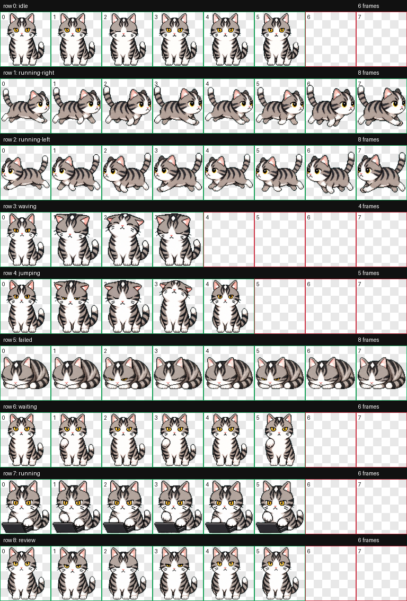

# dsh-luna-pet

An animated, interactive desktop pet for the DeepSeek Harness Web UI. Luna (露娜) is the user's existing pixel-style American Shorthair cheese cat, reused from the local Codex pet package with all nine animation states intact.

## Install

```powershell
dsh plugin --profile web add ./showcase/dsh-luna-pet
dsh web --port 3080
```

Use the same `DSH_HOME` for installation and every restart.

## Interactions

- hover Luna to accept a head pat;
- click Luna to play her contented animation;
- drag Luna herself with a mouse, pen, or touch pointer to place her anywhere in the viewport;
- keep the chosen position across page reloads;
- choose Idle, Work, Wait, Review, Patrol, or Oops;
- collapse the controls into compact pet-only mode;
- respect the operating system's reduced-motion preference.

The package contributes only the additive `shell.overlay` slot. Luna is rendered without a surrounding card frame, and her position is kept within the visible viewport. The plugin does not replace `root`, `sidebar`, `conversation`, or any agent-loop behavior.


## Asset provenance

The 8×9 WebP atlas comes from the existing `~/.codex/pets/luna` package. This plugin re-validates it with the `hatch-pet` workflow before embedding it as a data URL, so installed profiles do not require an asset server and the source pet files are never modified.

Luna's original row 3 and row 4 are intentionally mapped as **petted** and **content** rather than claiming they are generic wave and vertical-jump cycles; the plugin follows the visible motions in the user's existing asset.


